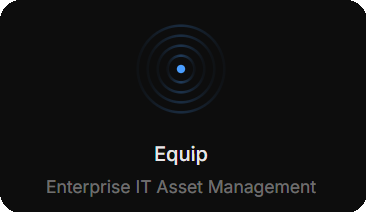
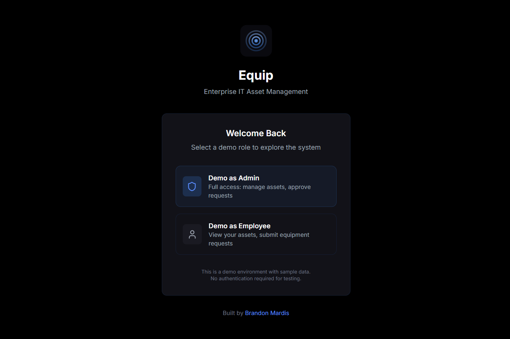
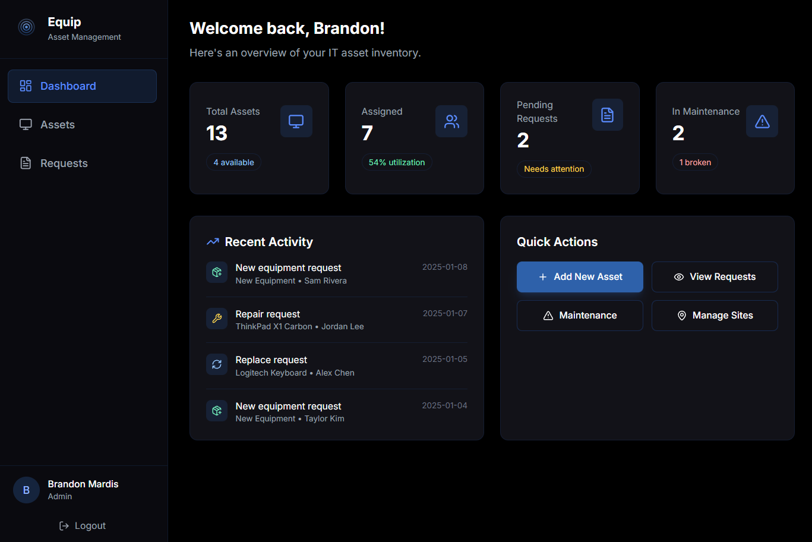

<h1 align="center">Equip</h1>

<p align="center">
  
</p>

<p align="center">
  <a href="https://equip-nu.vercel.app">
    
  </a>
</p>

---

## Features

- **Asset Tracking** — Manage laptops, monitors, docking stations, and peripherals
- **Employee Assignment** — Assign equipment and track who has what
- **Request System** — Handle repair and replacement requests with approvals
- **Multi-Site Support** — Organize assets across HQ and remote offices
- **Role-Based Access** — Admin and employee views with different permissions

---

## Screenshots

<p align="center">
  
  
</p>

---

## Built With


---

<details>
<summary><strong>For Developers</strong></summary>

### Run Locally

```bash
# Install dependencies
npm install
pip install fastapi uvicorn

# Start API (terminal 1)
python -m uvicorn api.index:app --reload --port 8000

# Start frontend (terminal 2)
npm run dev
```

Open http://localhost:5173

### Demo Access

Use the "Demo as Admin" or "Demo as Employee" buttons - no login needed.

- **Admin**: View all assets, add inventory, approve requests
- **Employee**: View assigned equipment, submit requests

### Deploy to Vercel

```bash
npm i -g vercel
vercel
```

Or connect your GitHub repo for automatic deployments.

</details>

---

## License

MIT © Brandon Mardis
